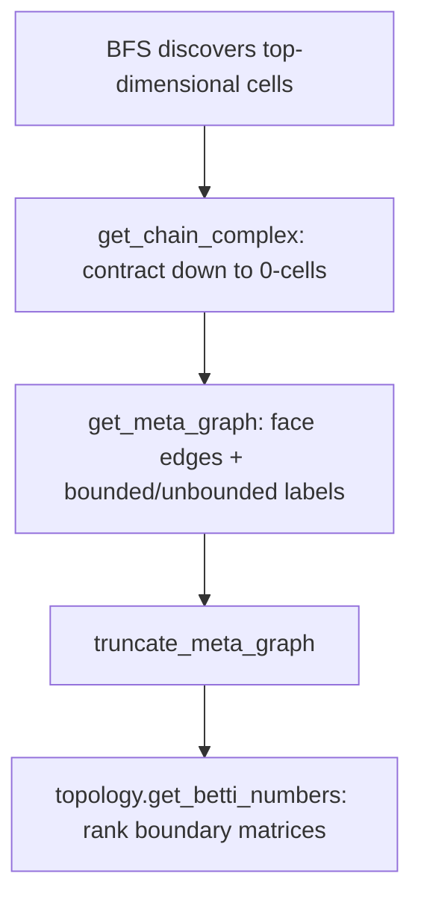

# How Relucent computes Betti numbers

This page walks through what happens when you call `cplx.get_betti_numbers()` with
no extra arguments — the default path most users hit.

**What you get back:** a dictionary `{k: β_k}` of Betti numbers computed over GF(2).
For example `{0: 1, 1: 2}` means one connected component, two independent 1-cycles,
and so on.

**What you need first:** a complex discovered by search (BFS, etc.). If exploration
stops early, some faces never appear as cells and the incidence data is incomplete.
You'll still get numbers, but they may not match the true topology of the full
arrangement.

---

## The default pipeline

When you call `get_betti_numbers()` with defaults (`compactify=False`,
`respect_finite=False`, no verification flags), the library runs these steps in order:

Each step is described below.

---

## Step 1: Build the chain complex

**Entry point:** [`get_chain_complex()`](../src/relucent/complex.py)

The chain complex is a list of `Complex` objects, one per dimension, from the
top-dimensional cells down to 0-cells (vertices). It is built by repeatedly
calling [`contract()`](../src/relucent/complex.py).

### How contraction works

1. Build the **dual graph** — combinatorial adjacency among cells at the current top
   dimension ([`get_dual_graph()`](../src/relucent/complex.py) →
   [`dual_edges_top_dim()`](../src/relucent/meta_graph.py)), then
   [`sync_shis_from_dual_graph()`](../src/relucent/meta_graph.py) so each cell's
   `_shis` list matches incident edge labels.
2. For each dual edge `(cell_a, cell_b, shi)`, zero `shi` in the sign sequence to
   get the tag of their shared `(k−1)`-face.
3. Create that lower-dimensional cell via `add_ss`, passing SHI metadata from
   [`_codim_one_face_kwargs()`](../src/relucent/complex.py).
4. Run [`assign_contracted_shis()`](../src/relucent/meta_graph.py)
   on the **contracted slice** to assign SHIs from coface intersection once all
   cells are present. Top-dimensional ambient cells do not use this step; their
   `_shis` come from the dual graph at search finalize. Infeasible 1-cell faces
   are dropped earlier in [`_codim_one_face_kwargs()`](../src/relucent/complex.py).

The loop stops when contraction produces 0-cells or an empty complex.

### Dual-graph rules depend on dimension

- **1-dimensional complexes** (`top_dim == 1`): two 1-cells are adjacent if they
  share a combinatorial 0-face (a vertex tag). This uses
  [`_dual_edges_one_dim()`](../src/relucent/meta_graph.py).
- **Higher dimensions**: two top cells are adjacent if they are **flip neighbors** —
  you can get from one sign sequence to the other by flipping a single nonzero entry.
  This uses [`_dual_edges_flip_neighbors()`](../src/relucent/meta_graph.py).

With default config, top-dimensional cells at ``max_dim >= 2`` (and top-level
``max_dim == 1`` slices) build edges combinatorially via
[`dual_edges_top_dim()`](../src/relucent/meta_graph.py) and sync ``_shis`` from
those edges.  **Contracted** 1-skeleton slices (``max_dim == 1`` but ambient
``self.dim > 1``) still iterate propagated ``poly.shis`` lists from coface
intersection — full SS flip-neighbor closure there would add spurious edges and
break ``∂² = 0``.  The ``cubical`` parameter is retained for API compatibility.

---

## Step 2: Build the meta-graph

**Entry point:** [`get_meta_graph()`](../src/relucent/complex.py)

The meta-graph is a directed graph whose nodes are cells (at every dimension found
in the chain complex) and whose edges record codimension-one face incidences. This
is the combinatorial input to the rank computation.

Each node stores `poly`, `dim`, `ss`, `finite` (bounded or not), and `shis`.

### Face edges — what actually defines Betti numbers

For every cell of dimension `k > 0`:

1. Look at every index `i` where `ss[i] ≠ 0` (via
   [`ss_nonzero_indices()`](../src/relucent/meta_graph.py)).
2. Zero that entry to get a candidate face tag ([`face_tag()`](../src/relucent/meta_graph.py)).
3. If a cell with that tag exists in the complex, add a directed edge
   `k-cell → (k−1)-face` with attribute `shi = i`.

This is implemented by [`collect_meta_face_edges()`](../src/relucent/meta_graph.py)
(per dimension, in parallel when there are enough cells).

**0-cells:** the face-edge loop skips `k ≤ 0`, so 0-cells never have outgoing face
edges. They can still appear as targets of edges from 1-cells.

**1-cells:** use the same face-edge rule as higher-dimensional cells — zero each
nonzero sign-sequence entry and connect to the resulting 0-face if it exists.

### Bounded vs unbounded labels

These labels decide which cells get truncated at infinity (Step 3). They do not
change how face edges are built.

Classification is **combinatorial** on the default path — no linear programs.

| Dimension | Rule |
|-----------|------|
| 0-cells | Always bounded |
| 1-cells | Bounded if at least two distinct combinatorial 0-faces appear in meta face edges ([`classify_one_cells_finite_from_face_edges()`](../src/relucent/meta_graph.py)). One 0-face → ray (unbounded). No 0-faces → geometric check: empty phantoms (`finite is None`) are excluded; feasible full lines are unbounded |
| k ≥ 2 | Unbounded if **any** `(k−1)`-face is unbounded; bounded if **all** `(k−1)`-faces are bounded ([`classify_finite_ascending()`](../src/relucent/meta_graph.py)) |

Before boundedness is checked, [`compute_contracted_shis_top_down()`](../src/relucent/meta_graph.py)
fills in `_shis` on contracted cells by propagating from cofaces (metadata only).
Top-dimensional cells already have `_shis` from BFS.

### A note on `_shis` vs the sign sequence

Cells carry a `_shis` list (supporting hyperplane indices where the cell actually
meets a bounding hyperplane). That list can be **smaller** than the set of nonzero
entries in the sign sequence.

That's fine. Face edges always scan the full sign sequence (`ss_nonzero_indices`).
The `_shis` list is stored as node metadata — not used for boundedness labels or
for deciding which face incidences exist.

---

## Step 3: Truncate at infinity

**Entry point:** [`truncate_meta_graph()`](../src/relucent/meta_graph.py)

This runs automatically when `compactify=False` (the default).

Unbounded cells (`finite is False`) get a duplicate node "at infinity":

- Every node's sign sequence gains an extra trailing bit set to `1` (inside the
  truncation region).
- Each unbounded cell `n` with `k > 0` gets a duplicate `("trunc", n)` at dimension
  `k−1`, with the trailing bit set to `0` (on the cut).
- An edge `n → ("trunc", n)` is added with `shi = TRUNCATION_META_SHI` (−1).
- Face edges among unbounded cells are mirrored on their duplicates.

**0-cells are never duplicated**, even if marked unbounded.

The idea is to model the link at infinity so homology of the truncated complex
reflects the topology of unbounded regions.

---

## Step 4: Rank boundary matrices

**Entry point:** [`topology.get_betti_numbers()`](../src/relucent/topology.py)

From the (possibly truncated) meta-graph:

1. Group nodes by dimension.
2. For each `k`, build a GF(2) boundary matrix ∂_k from directed edges
   (`k-cell → (k−1)-face`). Columns index `k`-cells; rows index `(k−1)`-cells.
   See [`_packed_boundary_matrix()`](../src/relucent/topology.py).
3. Compute ranks with [`gf2_rank_boundary()`](../src/relucent/topology.py) (C
   extension when available, Python fallback otherwise).
4. Apply the cellular formula:

   `β_k = (number of k-cells) − rank(∂_k) − rank(∂_{k+1})`

### β₀ is special

When 0-cells are present (`kmin == 0`), β₀ is set from the number of connected
components of the meta-graph (edges treated as undirected), not from the rank
formula alone. This stays correct after truncation, where half-edges at infinity
would confuse a pure rank count.

When there are no 0-cells (e.g. a boundary complex with only 1- and 2-cells), the
lowest key in the returned dictionary is `1`, not `0`.

Zero entries are dropped from the result.

---

## Exploration and verification

After a **complete** ambient BFS (`verify=True` by default), relucent:

1. Rebuilds combinatorial dual-graph edges and syncs top-cell `_shis`
   ([`finalize_ambient_search()`](../src/relucent/exploration.py) via
   [`Complex.get_dual_graph()`](../src/relucent/complex.py)).
2. Runs fast invariant checks ([`verify_complex()`](../src/relucent/verify.py)),
   including an LP facet completeness test when `cplx.complete is True`.

Verification is skipped if `max_polys` is hit before the frontier empties. Check
`cplx.complete` and `cplx.verified` before calling `contract()` or
`get_boundary_complex()`.

See the Sphinx guide *Exploration and Verification* (`docs/exploration_verification.rst`)
for user-facing detail.

---

## Other options (non-default)

These change behavior when you pass extra flags to `get_betti_numbers()` or
`get_meta_graph()`:

- **`compactify=True`** — Borel–Moore style: no truncation; only faces with at least
  two cofaces contribute to boundary maps.
- **`compactify="one_point"`** — adds a single 0-cell at infinity for unbounded
  1-cell ends ([`one_point_compactify_meta_graph()`](../src/relucent/meta_graph.py)).
- **`respect_finite=True`** — restrict to cells with `finite is True` before ranking
  ([`finite_cells_subgraph()`](../src/relucent/meta_graph.py)); no truncation.
- **`verify_chain_complex=True`** — require ∂² = 0; raises if the complex is
  incomplete.
- **`get_meta_graph(verify=True)`** — second pass re-deriving SHIs and boundedness
  from the assembled graph (debugging).
- **`verify_arrangement_genericity()`** — geometric transversality check on 1-cells
  (off by default; `VERIFY_GENERICITY=False`).

---

## Function map

### By pipeline step

| Step | Main functions |
|------|----------------|
| Search | `Complex.bfs`, `exploration.finalize_ambient_search`, `Complex.get_dual_graph` |
| Chain complex | `get_chain_complex`, `contract`, `get_dual_graph`, `dual_edges_top_dim`, `_codim_one_face_kwargs`, `assign_contracted_shis` |
| Meta-graph | `get_meta_graph`, `compute_contracted_shis_top_down`, `ss_nonzero_indices`, `face_tag`, `collect_meta_face_edges`, `classify_finite_ascending`, `meta_node_attrs` |
| Truncation | `truncate_meta_graph` |
| Ranks | `get_betti_numbers`, `get_betti_numbers_from_meta`, `_packed_boundary_matrix`, `gf2_rank_boundary` |

### 0-cells and 1-cells at a glance

| | 0-cells | 1-cells |
|---|---------|---------|
| Face edges | None outgoing | Zero each `ss[i] ≠ 0` → connect to 0-faces |
| Boundedness | Always bounded | `len(_shis) ≥ 2` → bounded segment |
| Dual graph (when top dim = 1) | N/A | Pair by shared 0-face tag |
| Truncation | Not duplicated | Duplicated at infinity if unbounded |
| One-point compactify | Synthetic `("infty",)` node added | Open ends get edge to ∞ |

---

## See also

- [Topology and Persistent Homology](topology.rst) — API overview and examples.
