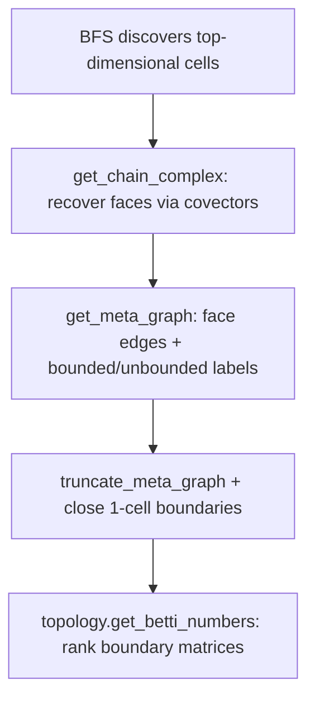

# How Relucent computes Betti numbers

This page walks through what happens when you call `cplx.get_betti_numbers()` with
no extra arguments — the default path most users hit.

**What you get back:** a dictionary `{k: β_k}` of Betti numbers computed over GF(2).
For example `{0: 1, 1: 2}` means one connected component, two independent 1-cycles,
and so on.

**What you need first:** a complex discovered by search (BFS, etc.). If exploration
stops early, some faces never appear as cells and the incidence data is incomplete.
You'll still get numbers, but they may not match the true topology of the full
arrangement.

---

## The default pipeline

When you call `get_betti_numbers()` with defaults (`compactify=False`,
`respect_finite=False`, no verification flags), the library runs these steps in order:

Each step is described below.

---

## Step 1: Build the chain complex

**Entry point:** [`get_chain_complex()`](../src/relucent/core/complex.py)

The chain complex is a list of `Complex` objects, one per dimension, from the
top-dimensional cells down to 0-cells (vertices). Lower-dimensional cells are
recovered from the labeled top-cell dual graph by
[`enumerate_covectors()`](../src/relucent/graph/covectors.py) — exact sign
intersection over cubical stars — not by iterative dual-edge contraction.

`Complex.contract()` is a thin wrapper that returns
`get_chain_complex(...)[self.dim - 1]`.

### How covector recovery works

1. Build the **dual graph** — combinatorial adjacency among top-dimensional cells
   ([`get_dual_graph()`](../src/relucent/core/complex.py) →
   [`dual_edges_top_dim()`](../src/relucent/graph/incidence.py)), then
   [`sync_shis_from_dual_graph()`](../src/relucent/graph/incidence.py) so each cell's
   `_shis` list matches incident edge labels. Certify the labeled graph with
   [`certify_dual_graph()`](../src/relucent/graph/incidence.py).
2. For each top cell, read incident SHI labels and enumerate every subset of those
   labels as a candidate face. The face sign sequence is the
   [`sign_intersection`](../src/relucent/graph/covectors.py) of the cubical star of
   top cells obtained by flipping those SHIs
   ([`enumerate_covectors()`](../src/relucent/graph/covectors.py)).
3. **Vertices (0-cells)** get one float64 equality solve from a witness coface,
   then strict forward-sign verification
   ([`Polyhedron.verify_vertex_covector`](../src/relucent/core/poly.py)). Rejected
   (phantom) vertices are dropped; 1-cells whose only combinatorial endpoints were
   rejected are skipped so they never enter the meta-graph as faces.
4. Materialize each recovered cell with `add_ss`, then run
   [`set_contracted_shis()`](../src/relucent/graph/incidence.py) on each lower-dim
   slice so authoritative `_shis` match
   [`cubical_cell_shis()`](../src/relucent/graph/incidence.py). In `CAREFUL_MODE`,
   [`verify_contracted_shis()`](../src/relucent/graph/incidence.py) asserts flip-neighbor
   symmetry. Top-dimensional ambient cells do not use this step; their `_shis`
   come from the dual graph at search finalize.

No facet or boundedness LP is used during covector recovery.

### Dual-graph rules

[`build_dual_graph()`](../src/relucent/graph/incidence.py) always routes top cells
through flip-neighbor adjacency ([`dual_graph_edge_top_dim()`](../src/relucent/graph/incidence.py)
maps ``max_dim == 1`` complexes to the ``top_dim >= 2`` flip path). For each
candidate crossing, add an edge when the same-dimension flip neighbor exists in
the slice ([`_dual_edges_flip_neighbors()`](../src/relucent/graph/incidence.py)).

- **Ambient top cells** — candidates from [`ss_nonzero_indices()`](../src/relucent/graph/incidence.py).
- **Contracted 1-skeleton** (``max_dim == 1``, ambient ``self.dim > 1``) — candidates
  from each cell's finalized ``poly._shis`` after
  [`set_contracted_shis()`](../src/relucent/graph/incidence.py).

Then [`sync_shis_from_dual_graph()`](../src/relucent/graph/incidence.py) overwrites
``poly._shis`` from edge labels. The legacy 0-face pairing in
[`_dual_edges_one_dim()`](../src/relucent/graph/incidence.py) remains for direct
``dual_edges_top_dim(..., top_dim=1)`` callers only, not for
``Complex.get_dual_graph()``.

**Related (not the ambient chain complex):**
[`get_boundary_cells`](../src/relucent/core/complex.py) /
[`get_boundary_complex`](../src/relucent/core/complex.py) still create faces from
dual edges via [`_codim_one_face_kwargs()`](../src/relucent/core/complex.py).

---

## Step 2: Build the meta-graph

**Entry point:** [`get_meta_graph()`](../src/relucent/core/complex.py)

The meta-graph is a directed graph whose nodes are cells (at every dimension found
in the chain complex) and whose edges record codimension-one face incidences. This
is the combinatorial input to the rank computation.

Each node stores `poly`, `dim`, `ss`, `finite` (bounded or not), and `shis`.

### Face edges — what actually defines Betti numbers

For every cell of dimension `k > 0`:

1. Look at every index `i` where `ss[i] ≠ 0` (via
   [`ss_nonzero_indices()`](../src/relucent/graph/incidence.py)).
2. Zero that entry to get a candidate face tag ([`face_tag()`](../src/relucent/graph/incidence.py)).
3. If a cell with that tag exists in the complex, add a directed edge
   `k-cell → (k−1)-face` with attribute `shi = i`.

This is implemented by [`collect_meta_face_edges()`](../src/relucent/graph/incidence.py)
(per dimension, in parallel when there are enough cells).

**0-cells:** the face-edge loop skips `k ≤ 0`, so 0-cells never have outgoing face
edges. They can still appear as targets of edges from 1-cells.

**1-cells:** use the same face-edge rule as higher-dimensional cells — zero each
nonzero sign-sequence entry and connect to the resulting 0-face if it exists.

### Bounded vs unbounded labels

These labels decide which cells get truncated at infinity (Step 3). They do not
change how face edges are built.

Classification is **combinatorial** on the default path — no linear programs.

| Dimension | Rule |
|-----------|------|
| 0-cells | Always bounded |
| 1-cells | Bounded if at least two distinct combinatorial 0-faces appear in meta face edges ([`classify_one_cells_finite_from_face_edges()`](../src/relucent/graph/incidence.py)). One 0-face → ray (unbounded). No 0-faces → geometric check: empty phantoms (`finite is None`) are excluded; feasible full lines are unbounded |
| k ≥ 2 | Unbounded if **any** `(k−1)`-face is unbounded; bounded if **all** `(k−1)`-faces are bounded ([`classify_finite_ascending()`](../src/relucent/graph/incidence.py)) |

### Node `shis` vs face edges

Face edges always scan the full sign sequence ([`ss_nonzero_indices()`](../src/relucent/graph/incidence.py)).
Meta-graph node ``shis`` are flip-neighbor crossings derived by
[`cubical_cell_shis()`](../src/relucent/graph/incidence.py) at node creation — metadata
only, not used for boundedness or incidence.

---

## Step 3: Truncate at infinity

**Entry point:** [`truncate_meta_graph()`](../src/relucent/graph/meta_graph.py)

This runs automatically when `compactify=False` (the default). Truncation is a single
incidence pipeline: extend sign sequences, materialize cap cells, then rebuild all face
edges with the same rule as [`get_meta_graph()`](../src/relucent/core/complex.py).

**Phase A — extend SS:** every node’s sign sequence gains **two** trailing truncation
bits. Bounded cells and rays use `[..., 1, 0]`; cells with two open ends use
`[..., 1, 1]`. Node keys are relabeled to `encode_ss(extended_ss)`.

**Phase B — openness:** bottom-up from codimension-one face structure:

| Situation | Caps on this cell |
|-----------|-------------------|
| `k≥2`, has bounded `(k−1)`-face and **any** unbounded facet | 1 cap (single sphere-cut patch) |
| `k≥2`, has bounded `(k−1)`-face, no unbounded facets | None |
| `k=1`, 2 bounded 0-endpoints | None (bounded segment) |
| `k=1`, 1 bounded 0-endpoint | 1 cap (ray) |
| `k=1`, 0 bounded 0-endpoints | 2 caps (line) |
| `k≥2`, all `(k−1)`-faces unbounded | inherit max openness from *sidedness* facets |

“Any unbounded facet” for the anchored 0-vs-1 rule uses the raw facet list (before
bi-infinite sidedness filtering). Sidedness filtering drops bi-infinite line facets
when `poly` is set — that filter drives *inheritance only*, so it cannot silently
force `n_caps=0` on an anchored cell that still has unbounded facets.

**Phase C — cap cells:** for each needed cap, `cap_tag = face_tag(parent_ss, truncation_bit_index)`.
If absent, add an ordinary byte-tagged node at dimension `k−1` with the appropriate
zeroed truncation bit. No `("trunc", …)` tuple nodes.

**Phase D — incidence:** clear face edges and rebuild via
[`collect_meta_face_edges()`](../src/relucent/graph/incidence.py) /
[`assemble_face_edges_by_dim()`](../src/relucent/graph/incidence.py), reclassify `finite`, refresh
`crossings` / `shis`, and run [`verify_meta_graph_one_cells()`](../src/relucent/graph/meta_graph.py).

Cubical `face_tag` rebuild recovers network faces only when parent and face share trunc
bits. Faces between cells with disagreeing openness (e.g. unilateral coface `(1,0)` and
bi-infinite line `(1,1)`) are omitted: restoring them without a matching sphere-cut
breaks `∂²=0`. Those cofaces keep their trunc-cap instead.

**0-cells are never duplicated**, even if marked unbounded.

The idea is to model caps at infinity so homology of the truncated complex reflects the
topology of unbounded regions. Each unbounded `k`-cell gets its own sphere-cut
`(k−1)`-cell; if it has a bounded facet the cut is a single connected patch (one cap),
built from the caps of its trunc-compatible unbounded facets.

---

## Step 4: Rank boundary matrices

**Entry point:** [`topology.get_betti_numbers()`](../src/relucent/topology/betti.py)

From the (possibly truncated) meta-graph:

1. Group nodes by dimension.
2. For each `k`, build a GF(2) boundary matrix ∂_k from directed edges
   (`k-cell → (k−1)-face`). Columns index `k`-cells; rows index `(k−1)`-cells.
   See [`_packed_boundary_matrix()`](../src/relucent/topology/betti.py).
3. Compute ranks with [`gf2_rank_boundary()`](../src/relucent/topology/betti.py) (C
   extension when available, Python fallback otherwise).
4. Apply the cellular formula:

   `β_k = (number of k-cells) − rank(∂_k) − rank(∂_{k+1})`

When there are no 0-cells (e.g. a boundary complex with only 1- and 2-cells), the
lowest key in the returned dictionary is `1`, not `0`.

Zero entries are dropped from the result.

---

## Exploration and certification

After a **complete** ambient BFS (`verify=True` by default), relucent:

1. Rebuilds combinatorial dual-graph edges and syncs top-cell `_shis`
   ([`finalize_ambient_search()`](../src/relucent/search/exploration.py) via
   [`Complex.get_dual_graph()`](../src/relucent/core/complex.py)).
2. Runs certification ([`certify_complex()`](../src/relucent/verify/certify.py) at
   `CertifyLevel.COMPLETE`), including an LP facet completeness test when
   `cplx.complete is True`.

Certification is skipped if `max_polys` is hit before the frontier empties. Check
`cplx.complete` and `cplx.verified` before calling `contract()`,
`get_chain_complex()`, or `get_boundary_complex()`. Re-run certification manually
with `Complex.certify()`.

See the Sphinx guide *Exploration and Verification* (`docs/exploration_verification.rst`)
for user-facing detail.

---

## Other options (non-default)

These change behavior when you pass extra flags to `get_betti_numbers()` or
`get_meta_graph()`:

- **`compactify=True`** — Borel–Moore style: no truncation; only faces with at least
  two cofaces contribute to boundary maps.
- **`compactify="one_point"`** — adds a single 0-cell at infinity for unbounded
  1-cell ends ([`one_point_compactify_meta_graph()`](../src/relucent/graph/meta_graph.py)).
- **`respect_finite=True`** — restrict to cells with `finite is True` before ranking
  ([`finite_cells_subgraph()`](../src/relucent/graph/meta_graph.py)); no truncation.
- **`verify_chain_complex=True`** — require ∂² = 0; raises if the complex is
  incomplete.
- **`get_meta_graph(verify=True)`** — runs
  [`verify_meta_graph_incidence()`](../src/relucent/graph/meta_graph.py) to assert
  assembled edges, node SHIs, and finite labels match the incidence engine (debugging).
- **`verify_arrangement_genericity()`** — geometric transversality check on 1-cells
  (off by default; `VERIFY_GENERICITY=False`).

---

## Function map

### By pipeline step

| Step | Main functions |
|------|----------------|
| Search | `Complex.bfs`, `exploration.finalize_ambient_search`, `Complex.get_dual_graph`, `incidence.*` |
| Chain complex | `get_chain_complex`, `covectors.enumerate_covectors`, `get_dual_graph`, `dual_edges_top_dim`, `set_contracted_shis` |
| Meta-graph | `get_meta_graph`, `meta_graph.truncate_meta_graph`, `incidence.cubical_cell_shis`, `incidence.ss_nonzero_indices`, `incidence.face_tag`, `incidence.collect_meta_face_edges`, `incidence.classify_finite_ascending`, `incidence.meta_node_attrs`, `meta_graph.verify_meta_graph_incidence` |
| Certification | `certify.certify_complex`, `Complex.certify`, `Complex.complete`, `Complex.verified` |
| Truncation | `truncate_meta_graph` |
| Ranks | `get_betti_numbers`, `get_betti_numbers_from_meta`, `_packed_boundary_matrix`, `gf2_rank_boundary` |

### 0-cells and 1-cells at a glance

| | 0-cells | 1-cells |
|---|---------|---------|
| Face edges | None outgoing | Zero each `ss[i] ≠ 0` → connect to 0-faces |
| Boundedness | Always bounded | Two or more distinct 0-faces in face edges → bounded segment; one → ray |
| Dual graph (when top dim = 1) | N/A | Pair by shared 0-face tag |
| Truncation | Not duplicated | Caps at infinity on unbounded cells (byte tags) |
| One-point compactify | Synthetic `("infty",)` node added | Open ends get edge to ∞ |

---

## See also

- [Topology and Persistent Homology](topology.rst) — API overview and examples.
