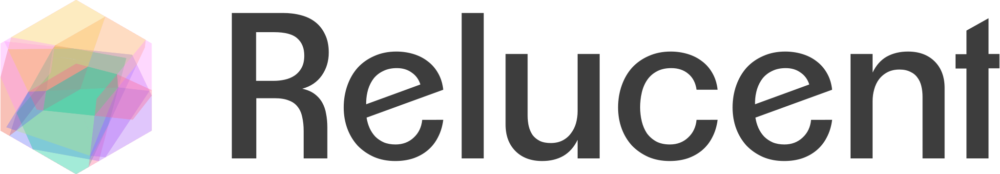

.. title:: Relucent Documentation

.. raw:: html

   

Relucent computes and visualizes the polyhedral structure induced by ReLU neural
networks. It helps you explore activation regions, compute
their geometric properties, and analyze how they are connected to each other.

Core capabilities include:

* Distributed local-search routines for discovering activation regions.
* Polyhedron-level queries (halfspaces, boundaries, centers, neighbors).
* Complex-level analyses and graph-based views of region adjacency.
* 2D and 3D visualizations using Plotly and matplotlib-backed utilities.
* Native compatibility with PyTorch models

.. toctree::
   :maxdepth: 1
   :caption: User guide:

   quickstart
   network_definitions
   search_geometry
   configuration

.. toctree::
   :maxdepth: 1
   :caption: API Reference:

   complex
   polyhedron
   utilities

Indices and tables
==================
* :ref:`genindex`
* :ref:`search`
