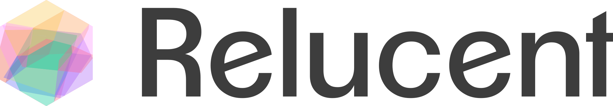

.. title:: Relucent Documentation

.. raw:: html

   

Relucent computes and visualizes the polyhedral structure induced by ReLU neural
networks. It helps you explore activation regions, compute
their geometric properties, and analyze how they are connected to each other.
This documentation is for relucent |release|.

Core capabilities include:

* Distributed local-search routines for discovering activation regions.
* Polyhedron-level queries (halfspaces, boundaries, centers, neighbors).
* Complex-level analyses and graph-based views of region adjacency.
* Topology of the complex and of decision boundaries over GF(2): Betti numbers,
  persistent homology, and PL Morse critical points.
* 2D and 3D visualizations using Plotly.
* Conversion of PyTorch models, checked against the model's own forward pass.

.. toctree::
   :maxdepth: 1
   :caption: User guide:

   quickstart
   network_definitions
   search_geometry
   search_shi_and_graphs
   exploration_verification
   topology
   betti_computation
   configuration
   migrating

.. toctree::
   :maxdepth: 1
   :caption: API Reference:

   complex
   polyhedron
   exploration
   boundary_search
   certify
   model
   sign_sequences
   geometry
   meta_graph
   incidence
   vertex_star
   filtration
   persistence
   topology_api
   morse
   vis
   utilities

Indices and tables
==================
* :ref:`genindex`
* :ref:`search`
